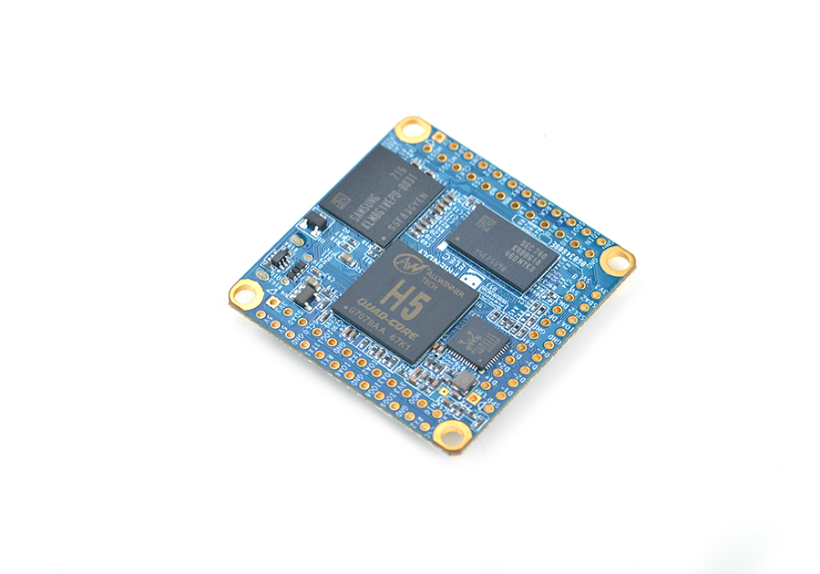

# Nanopi Core2 

This is a base Nerves System configuration for the [NanoPi Core2](http://www.orangepi.org/orangepizero/).

 [Image credit](#nanopi)

* CPU: Allwinner H5, Quad-core 64-bit high-performance Cortex A53
* DDR3 RAM: 512MB/1GB
* Storage: 8GB/16GB/32GB eMMC
* Connectivity: 10/100/1000M Ethernet utilizing RTL8211E-VB-CG
* USB Host x 3(included in 2.54mm pitch pin header)
* MicroSD Slot x 1
* LED: x 2, one for power status and the other for system status
* GPIO1: 2.54mm pitch 12 x 2 pin header containing UART, SPI, I2C, GPIO and etc
* GPIO2: 2.54mm pitch 24 pin header containing SPI, IR, I2S, USB, serial debug port, audio and etc
* GPIO3: 2.54mm pitch 20 pin header containing USB, Gbps Ethernet, I2C and etc
* PCB Size: 40 x 40mm

## Preparing your NanoPi Core2

...

## Console access

The console is configured to output to `ttyS0` by default. This is the
UART output accessible by the 4 pin header (labeled "Debug Serial Port" above). A 3.3V FTDI
cable is needed to access the output.

The Orange Pi Zero does not support HDMI output.

## Linux / Driver Support

### Device tree overlays

Both the SPI and I2C devices have been enabled in the default in-kernel DTS via a kernel patch. Supporting runtime configuration of I2C/SPI is less straightforward than RPi's which have many tools available for apply DTS fragments. If you need to enable or disable these ports, please feel free to submit a pull request with the appropriate tooling support. Future work may involve porting over the `configfs` patches from the Armbian project for this purpose.

## Installation

If [available in Hex](https://hex.pm/docs/publish), the package can be installed as:

  1. Add nerves_system_nanopi_core2 to your list of dependencies in `mix.exs`:

        def deps do
          [{:nerves_system_nanopi_core2, "~> 0.2.0", github: "elcritch/nerves_system_nanopi_core2"}]
        end

[Image credit](#nanopi): This image is from the [Nano Pi Website](http://www.friendlyarm.com/).
